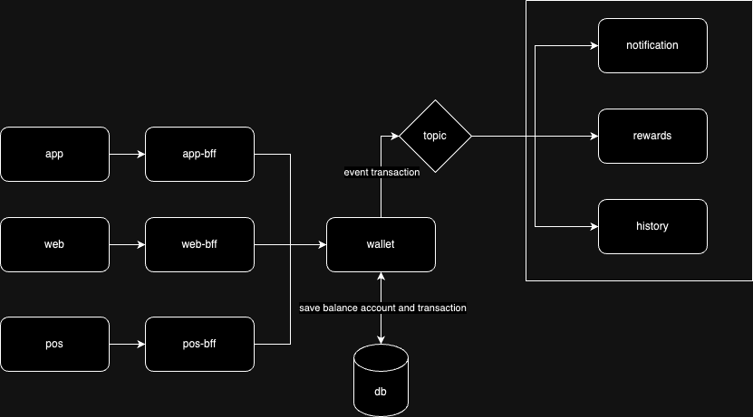

### Realizando o processo de build

```
./gradlew clean build
```


### Rodando a aplicação

Primeiro, deve-se subir as dependências do projeto:
```
docker-compose up -d postgres
```
Depois disso, rode a aplicação:
```
./gradlew bootRun
```

### Rodando testes unitários

Para rodar os testes unitários:

```
./gradlew test
```

### Rodando os testes de integração
Para rodar os testes de integração, primeiro certifique-se que as dependências do serviço não estão rodando:

```
docker-compose down
```

Por fim, rode os testes:

```
./gradlew integrationTest
```

### Arquitetura

